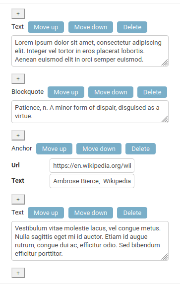
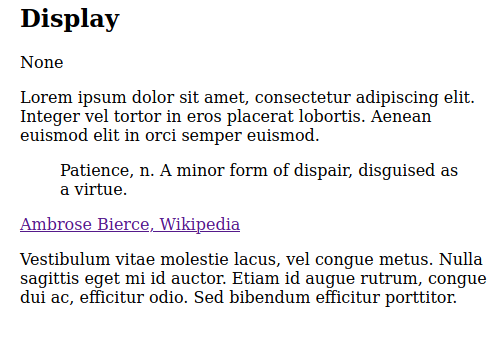
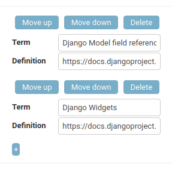
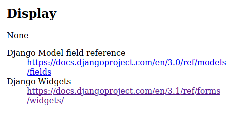

# StreamField
A Streamfield for Django. Saves data as JSON to the referenced field. The admin display is designed to operate unobtrusively and be styled as the stock Django Admin.

The distribution is called 'django-streamfield-w', but internally the module is called 'streamfield'.

## Pros
- It's a StreamField
- Written data should be Wagtail-compatible (mostly, no guarantee)

## Cons
- No file or image handling (unless you implement from another app)
- Small but scenery-chewing admin

And an admission: anything that works here has needed code reduction, code expansion, and/or hacks. There are still many possibilities for work within the programmer API. So this codebase will not be solid anytime soon, and lacks tests on code, app, and distribution. Best I can say is that I have outlined the functionality.

## Examples
Want to give a user the ability to add blocks of text, interspaced with blockquotes, URL links and dates?  Declare this field,

    body = StreamField(
        block_types = [
            ('text', blocks.TextBlock),
            ('blockquote', blocks.BlockQuoteBlock),
            ('anchor', blocks.AnchorBlock),
            ('date', blocks.DateBlock),
        ],
        verbose_name="Content"
    )

The form looks like this,

which renders as,

Want a list of web-links in the footer of your articles on coding? Declare this field,

    weblinks = DefinitionListField(
        definition_block = blocks.RawAnchorBlock,
        verbose_name="Web links"    
    ) 

The form looks like this,

which renders as,

## Alternatives
[Steamfield](https://github.com/raagin/django-streamfield/blob/master/README.md) for Django.

This app didn't work for me. However, the UI, which uses Django's popup mechanism, is interesting, as is the code. There are substantial and notable differences between this app and the code provided here.

## If you have done this before
- [Install](#install)
- [Add fields](#declaring-fields) to models that will use them
- (as you would usually) Migrate the models

That's all.

## Install
No dependencies. PyPi,

    pip install django-streamfield-w

Or download the app code to Django.

Declare in Django settings,

        INSTALLED_APPS = [
            ...
            'image.apps.StreamfieldConfig',
            ...
        ]

## Overall
A streamfield is [declared as a model field](#declaring-fields). That field is, unlike most model fields, a growable value of elements which may be of different types. The data is stored as JSON.

'Blocks' is the name for the types of items that can be inserted in a streamfield. Blocks to be made available must be declared in the field.

Underneath, blocks know how to render themselves as a form item. So the supplied Javascrript will allow a user to extend the value held by the field  to any number of sub-values.

When rendered, all the subvalues will be [templated to the screen](#display)

## Declaring fields
Like this, in 'models.py',

    class Page(models.Model):
        ...
        stream = StreamField(
            block_types = [
                ('heading', blocks.CharBlock()),    
                ('text', blocks.TextBlock()),    
            ],
            verbose_name="Page content"
            )

Block declarations can be classes, or instances with [optional parameters](#block-attributes).

Like the model classes in Django Admin, if you set 'block_types' empty it will not default to 'all blocks'. Instead, the field will issue a warning that no blocks will be shown in the field. This is a small security measure.
 
If you want to declare many similar fields, 'block_types' can be declared in class,

    class MyStreamField(
            '''
            A StreamField that allows subtitles, images and text, nothing else
            '''
            block_types = [
                ('subtitle', blocks.CharBlock()),    
                ('image', blocks.ImageBlock()),                    
                ('text', blocks.TextBlock()),    
            ],
            verbose_name="Page content"
            )

#### ListField
You may not want a full StreamField. If you want a list, a StreamField is not what you want to say to a user (a ListBlock inside a Strreamfield means the list is replicable, not it's elements). Use a ListField,

    class Page(models.Model):
        ...
        stream = ListField(
            block_type = blocks.CharBlock(max_length=255),
            verbose_name="Page list"
            )

#### Model-field attributes
Are the same as any model field, 'blank', 'help_text', 'verbose_name', 'validators' etc. Consider that the value on this field is a lump of JSON that is recursively evaluated, and the forms are an embedded heap. Setting 'primary_key' on a StreamField is strange, and 'null' should be avoided.

#### Side note - get_searchable_content()
Streamfield has a method get_searchable_content(). This is inherited from Wagtail, which has builtin search engine API. While there is nothing in Django that uses the method, it is maybe useful, so I left it in.

## Blocks
'Blocks' is the name for the items that can be inserted in a streamfield.

Blocks are tricky concept containing elements of Django model-fields, form-fields, and widgets. But if you are implementing, you only need to know one attribute,

    css_classes
        list of strings to be used as classnames in HTML rendering. The value is passed to the context. 

This attribute is a limited replacement for the widget attribute 'attrs'. CSS classes are only printed when the template enables this. Most of the default templates for blocks enable printing, except where there is no HTML at all.

### Field blocks
There blocks represent most of Djangos's form fields. To get you going, here is a declaration,

    class Page(models.Model):

        class Creepy(models.TextChoices):
            SPIDER = 'SP','Spider'
            ANT = 'AT','Ant'
            PYTHON = 'PY','Python'
            BAT = 'BT','Bat'
            CRICKET = 'CR','Cricket'
            MOTH = 'MO','Moth'

        stream = StreamField(
           block_types = [
                ('chars', blocks.CharBlock(
                    required=False,
                    help_text="A block inputting a short length of chars",
                    max_length=5,
                    ),
                ),
                ('subtitle', blocks.HeaderBlock()),
                ('subsubtitle', blocks.HeaderBlock(level=4)),
                ('quote', blocks.QuoteBlock(
                    required=False,
                    ),
                ), 
                ('url', blocks.URLBlock),
                ('relurl', blocks.RelURLBlock),
                ('email', blocks.EmailBlock(css_classes=['email'])),
                ('regex', blocks.RegexBlock(regex='\w+')),
                ('text', blocks.TextBlock()),    
                ('blockquote', blocks.BlockQuoteBlock()),
                ('html', blocks.RawHTMLBlock()),
                ('bool', blocks.BooleanBlock()),
                ('choice', blocks.ChoiceBlock(choices=Creepy.choices)),
                ('choices', blocks.MultipleChoiceBlock(choices=Creepy.choices)),
                ('integer', blocks.IntegerBlock()),
                ('decimal', blocks.DecimalBlock()),
                ('float', blocks.FloatBlock()),
                ('date', blocks.DateBlock()),
                ('time', blocks.TimeBlock()),
                ('datetime', blocks.DateTimeBlock(css_classes=['datetime'])),
                ('rawanchor', blocks.RawAnchorBlock()),
                ('anchor', blocks.AnchorBlock()),
            ],
            verbose_name="Page blocks"
            )
            ...

As you can see from the declarations, blocks can be declared as classes (with default parameters), or instances (with optional parameter details).

You may note the lack of a FileBlock/FileUploadBlock. This would give embedded images, so is a serious loss. However, it difficult to make an upload block, as Django spreads the functionality across model processing, and there is no model instance or field to work with (StreamField data is a lump of JSON). If your images/galleries etc. are tracked in the database, make a custom ModelChoceBlock. That's the Wagtail solution.

Notes on some of the blocks,

    ChoiceBlock and MultipleChoiceBlock 
        To make them work, give them choices. The blocks will handle the types and their storage. These blocks cut back on Wagtail/Django provision, they need static declarations, will not accept callables, etc. 

    RelURLBlock 
        Accepts relative URLs and fragments, unlike Django's UELField (the field is also a bit stricter about what gets in)

    ModelChoiceBlockBase 
        A base to build on. See below.

    RawAnchorBlock
        An HTML anchor where the text is a repetition of the href attribute.

    AnchorBlock
        A dual input block built with StructBlock that generates... an HTML anchor.

You may note that the value applied to the templates is the value from the database. This may not be always what you want, especially with enumerables. You can break up the stream and address the properties individually, or construct template tags etc.

#### Block attributes
The field Blocks (not the collection blocks) wrap Django form fields Some standard attributes from the form fields are exposed,

    required
        Works, but in a slightly different way to a form field. If True (the default) the block inpput can not be empty, if the block is summoned by the user.. 
    widget
        Set a different widget 
            #initial  
    help_text
        Set a help text on the block  
    validators
        Add validators to the block
    localize
        Localise block displays

and this widget-like attribute, 

     placeholder
         set the placeholder on an input

Unlike Wagtail, but like Django, all blocks are required unless declared otherwise.

Other form-field parameters such as 'label_suffix', 'initial', 'error_messages', 'disabled', are either fixed or not useful for blocks.

Some blocks have extra attributes. Usually these are similar to form field attributes, but you need to go to source to check.

#### ModelChoiceBlocks
The ModelChoiceBlocks are ModelChoiceBlock and ModelMultipleChoiceBlock, both building from ModelChoiceBlockBase (hope you are okay with that). They offer the possibility of building selections from any Django model, which opens many possibilities.

The fields accept the common parameters, and these,

        target_model
            The model to do queries on
        target_filter
            A query to limit offered options. The query is organised as a dict e.g. {'headline__contains':'Lennon'} 
        to_field_name
            The field to use to supply label names.
        empty_label
            An alternative to the default empty label (which is '--------')

The querybuilding is unlike the usual Django or Wagtail provision. 

#### Widgets
The widgets used as default are a strange collection. To give you some idea,

    Charboxes (URL, Email, Regex)
         Are Django Admin (which are a light restyle for size)
    Textareas (inc. RawHTMLArea and Blockquote)
        Home-brew auto-resize (an idea from Wagtail, re-implemented here)
    Time/Date inputs
        Home-brew TimeDate handler

A word about the temporal widgets: the Javascript may crash on asserting a locale. Either use stock Django widgets,

    from django.forms.widgets import DateTime

            block_types = [
                ...
                ('subtitle', blocks.DateBlock(widget=DateTime)),
            ]

or explicitly state formats (see below).

Like other Django widgets, if you like AutoHeightTextWidget or the temporal widgets you can use them elsewhere.

##### The temporal widgets
Django's temporal input form-handling is a tiring mass of code. Formats do not fall through model-fields, to form-fields, to widgets. There are catch-sensible-input defaults in the decode process. Decode and encode happen in different places in the codebase, handled by different code resources. And declared formats can be subverted by locale handling.

If you want to do interesting things with temporal inputs, you will need to set the form field so the format will be accepted. Then you also need to set the format on the widget. Nothing to do with this app or Wagtail, it's a Django thang,

    class SpaceyDateBlock(blocks.DateBlock):
        widget = MiniDateWidget(format='%d / %m / %Y')

Then set on the field,

            block_types = [
                ...
                ('subtitle', SpaceyDateBlock(input_formats=['%d / %m / %Y'])),
            ]

### Collection blocks
These blocks represent collections of other blocks,

    ListBlock
        An unfixed collection of similar blocks

    StreamBlock
        An unfixed collection of disimilar blocks (block choice offered to user)

    StructBlock
        A fixed collection of disimilar blocks

#### ListBlock
An unlinited list of a single block type,

    class Page(models.Model):
        stream = StreamField(
            block_types = [
                ('list', blocks.ListBlock( blocks.CharBlock )),
            ],
            verbose_name="Page blocks"
        )
        ...

Now that is interesting. To represent a list using database records needs a specialised table with foreign key links. Though in many cases you may want the modelfield wrap of this block, a [ListField](#ListField)

##### DefinitionListField 
In line with basic HTML provision, there is also a specialist DefinitionListField.

It accepts common attributes plus,

    term_block_type
    definition_block_type

#### StructBlock
A fixed collection of different block types. It can be declared in-place,

    class Page(models.Model):
        stream = StreamField(
            block_types = [
                ('link', blocks.StructBlock([
                    ('url', blocks.URLBlock()),
                    ('title', blocks.CharBlock()),
                    ]),
                ),
            ],
            verbose_name="Page blocks"
        )
        ...

This will do as you hope, produce a one-click field of several blocks at once. However, inline StructBlocks are confusing to write and read, and the agility of StructBlocks is maybe better demonstrated by subclassing and applying declarations,

     class Licence(models.TextChoices):
            NO_RIGHTS = 'CCO', 'Creative Commons ("No Rights Reserved")' 
            CREDIT = 'CC_BY', 'Creative Commons (credit)'
            CREDIT_NC = 'CC_BY-NC-ND', 'Creative Commons (credit, non-commercial, no adaption)'
            NON_EXCLUSIVE = 'NE','Non-exclusive Rights available'
            EXCLUSIVE = 'EX','Exclusive rights available'

    class QuoteBlock(blocks.StructBlock):
        quote = blocks.BlockQuoteBlock
        author = blocks.CharBlock()
        date = blocks.DateBlock()
        licence = blocks.ChoiceBlock(choices=Licence.choices)

    class Page(models.Model):
        stream = StreamField(
            block_types = [
                ('text', blocks.TextBlock()),
                ('quote', QuoteBlock()),
            ],
            verbose_name="Page block"
        )

This is a big StreamField win. A user can write text, then insert this QuoteBlock anywhere they like, Which database solutions can not do. And RichText i.e. text markup, can not structure the input.

#### StreamBlock
StreamBlock is an unlimited list of different block types. It is the base block of a Streamfield. It can also be embedded in a StreamField. 

Attributes are the common set plus,

    max_num
    min_num

The reason you would embed a StreamBlock is to establish a different context for the user to work in, for example, creating an index. Think before you do this. It will be difficult coding, and hard for a user to understand. Also, it will encourage blobs of data in the database, which is the argument against this kind of Streamfield. Can the context be regarded as a fixed entity? In which case, maybe it should be on a separate database field or table. That said, it can be done.

### Custom blocks
Not as difficult as promised. If you already have a form field you wish to use, you can wrap it, see 'form_field.py' for details. There is usually a form field that will handle data in the way you want. Most of the time, you will want a different widget or to change rendering. Well, 'widget' has been broken out as an attribute, and can be passed as an instance or class. For a one-off change, in 'models.py',

    body = StreamField(
        block_types = [
            ('float', blocks.FloatBlock(widget=MySuperFloatWidget(point_limit=3))),
        ]

Or if you plan to use the new widget field a few times,

    class GroovyFloatBlock(FloatBlock):
        widget = MySuperFloatWidget

To change rendering, this is the code from QuoteBlock,

    class QuoteBlock(CharBlock):

        def render_basic(self, value, context=None):
            if value:
                return format_html('<quote>{0}</quote>', value)
            else:
                return '

To initialise Javascript, there is a widget mixin called 'WithScript'. See the next section.

#### Issues with custom blocks
Streamfield adds form elements dynamically to the form. It will pick up and add Media resources attached to a widget. If you have a plain widget, this is all you need. But if you want a fancy widget, you need to think about the Javascript.

Javascript that supports widgets used in streamfields is tricky. Javascript designed to run on page load will not trigger. And the script may not have a non-page-load initialisation. Finally, there may be issues with JS dependency resolution. Django provides some help, but you need to know about it. 

The problems start here. Many, many Javascripts auto-run on page initialisation. You can hope that this is disabled or ineffective. But if not, or the script produces side effects in the form, you will need to modify the script, much as you may dislike the idea (I would).

Then you must hope the author built the script with a hook for initialisation. Again, if such a breakout of functionality is missing. you will need to modify.

Then you need to initialise. First, ignore the method in blocks called jsinitialiser(). This may seem promising, but it is for setup of block code on page load. The Wagtail solution is to add a script to the block template (the template is written into the page). This will run whenever a block is loaded into the main form. In a typically cute piece of code, Wagtail have a mixin to do this, called WidgetWithScript. WidgetWithScript is ported to this app as 'streamfield.widgets.WithScript'. All the field block widgets use it.

If initialisation is not targeted and precise, there can be unwanted effects. For example, outside of Streamfields, a few people have wished to reuse Django Admin widgets. Well, if the widget initialisation runs on page load, then is initialised dynamically later, forms can display with, for example, multiple clocks and calenders attached to temporal inputs. And there is no way to namespace this behaviour away.

Finally, you need to consider Javascript imports. Django does a somewhat unpubicised dependency resolution on JS resources. Mostly this is great, removing duplicates and ensuring, for example, that JQuery scripts run after JQuery is loaded. But, in such a case, you must declare a JQuery dependency in the widget, or the resource may be sorted before the JQuery library. And don't try a simple rename on JS resources, in the hope this will namespace the code. The dependency resolution will not be able to see the code rename, so will write the code in twice, and then you are in trouble. 

All in all, to add Javascripted widgets to a streamfield block,
- Preferably find Javascript that does nothing on pageload, or disable it. Especially avoid Javascript with general searches. You need a function ''do this to element with 'id' XXX'
- Add the widget to a new FieldBlock, using the broken-out definitions above
- Use streamfield.widgets.WithWidget to initialise
- On the Media class of the widget, declare dependencies for the Javascript, including external dependencies like JQuery
- Besides dependencies, beware how the Javascript loads into namespaces. If it is loaded on ''window', will it clash/ produce side-effects?

This  app has default widgets that seemed to suit the overall theme. but the above points were also a consideration.

## Display
Mostly, you only need to print the value,

    {{ page.content }}

This will template each block used with the default templating.

### The template tag
There is o template tag which allows you to control/supplement the supplied context.

    

                ...
                <article>
                ...
                 
                ...
                </article>

#### More on rendering
A value can be iterated, then the tag called (in recursive fashion) on elements,

    
        


    

And the elements can be controlled by their 'block_type' and 'value' directly,

    
        
            <h1>{{ block.value }}</h1>
        
            <section class="block-{{ block.block_type }}">
                
            </section>
        
    

I would not be keen on programming which individually targets elements, because what happens if you later introduce collections into the field? But the possibility is there.

## Templating and HTML
### Overview
It's difficult to produce generic HTML for StreamFields, because the potential uses are many. If you approach the app with specific needs, you should be expecting to override or produce your own blocks to adjust rendering.

The default rendering is set to be slim and somewhat aimed at supporting HTML typography. For example, text fields render in paragraph tags, numbers have no markup at all.

## Migration

## Notes
### What is a streamfield?
When people talk about text, they usually mean more than that. They usually mean a descending block that includes text, images, maybe titles, and various other structures such as lists and indexes. The 'content'.

How to represent this in a structured way has always been an issue, especially for databases. Some very, very structured text can be broken into database fields. Think of a product review, which will have a title, photograph, review and conclusion. Indeed, reviews are often used as an example.

But much text is not rigidly structured. An article for a newspaper may have images inserted, depending on what the staff managed to photograph. A book may have occasional illustrations. An author of technical books may wish to insert tables or checklists. The rigid structures of a database can not model these cases.

The answer would seem to be obvious, and has been used for years. Various text markup languages, from LaTex to HTML are designed to define structures which can be organised in a freeform way. Why not store these as a blob of text in a 'content' or 'body' database field?

Unfortunately, this fails both the end-user and the computer. The end user knows the structures they want. They know they want a blockquote, even if they don't know the name for it. But they have no time or life to learn markup. So they try to reproduce what they see using indents, or worse, tabs. Coders try to get round this using complex WYSIWYG editors but, marvels of coding though they are, the structure is still not reaching the user. It's known fact that users hate those editors. They never "do what I want".

As for computers, the data is stored in an unstructured blob in a hard-to-parse text format. And if the user has faked text structure, there is no record of their intention. And introducing the possibility of markup to end-users opens up a large security hole.

A streamfield stores the structures of the text not as text markup, but in a computer format. There are at least two ways of storing the structures. The first is to keep all structures in dedicated tables, for example a 'blockquote' table, and keep track of the order a user asked for them to be organised. The other way is to write down a blob of data to a field, but in a format computers can get to grips with, like JSON.

Either way, a computer format benefits both user and computer. The user gets a stream of forms that "do what they want". If they don't find a form, at least that is clear. And the computer gets the kind of data they like, structured lists of encoded data.

The main difficulty is that the structures are a massive challenge to web-coders. They need to be parsed to produce a screen representation. And making forms for all the structures needed is a trial of endurance. Not to mention that dynamically creating web-forms is a Javascript/HTML battleground. But people are trying. 

## The difference between Django-streamfield and Wagtail CMS implementations
Django-streamfield stores block data in dedicated database tables. This is good for reusing existing components. It can be good for maintenance because it single-sources maintenance operations such as migration, data dumps, and transfer/salvage.

Wagtail CMS stores block data as JSON, in text fields. This represents the structure intended by the coder. JSON is a robust, maintainable and human-readable format. But this approach creates much work on UI widgets for modification and display of data.

So one represents a clean, easily leveraged solution. The other represents what may become an industry-standard solution, at a cost of code size and complexity. 

### Why not use Wagtail?
Maybe you should. But Wagtail introduces code you may not want or find limiting, such as preset Page types, modified middleware and admin, new configuration methods, stacks of resulting preset URLs, and plenty more.

### Why didn't you include the RichText code?
Wagtail has a well-worked Richtext implementation. But, in short, this app has some integrity to defend. It's a Streamfield implementation, not a "useful stuff nicked from Wagtail" app.

### History/Credits
This was originally intended to be a port of Wagtail's StreamField. However, that code is closely tied to Wagtail's custom Admin, so was abandoned. I looked at [Steamfield](https://github.com/raagin/django-streamfield/blob/master/README.md), but that code is tied to it's data representation. I reverted to porting the Wagtail code. Because [this](https://pypi.org/project/wagtail-react-streamfield/) exists, this code sooner or later becomes a maintained branch.

The base Javascript and field handling remains as in Wagtail. There are tricks to make this work in Django, and most Wagtail-specific functionality is removed. The programmer API is reworked and extended, and not like Wagtail.

Throughout, I was trying not to learn anything about StreamField implementations. I only partially succeeded.
